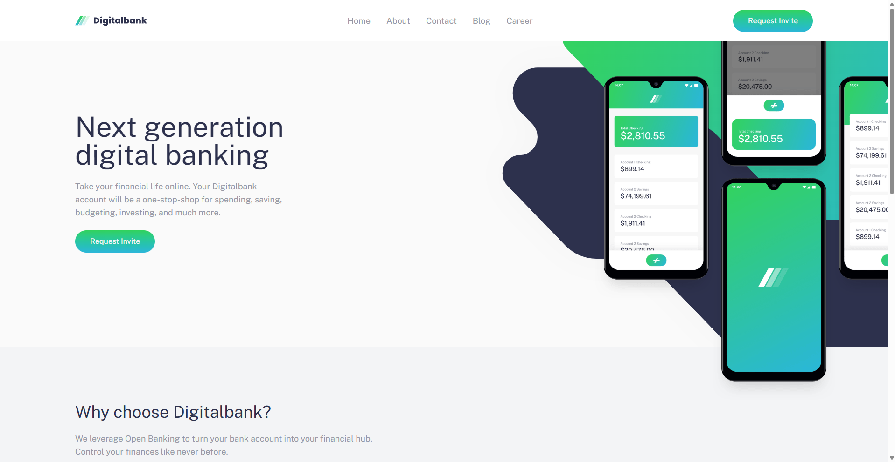
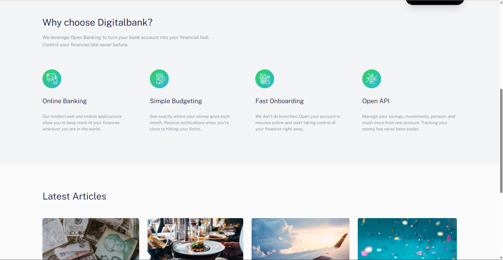
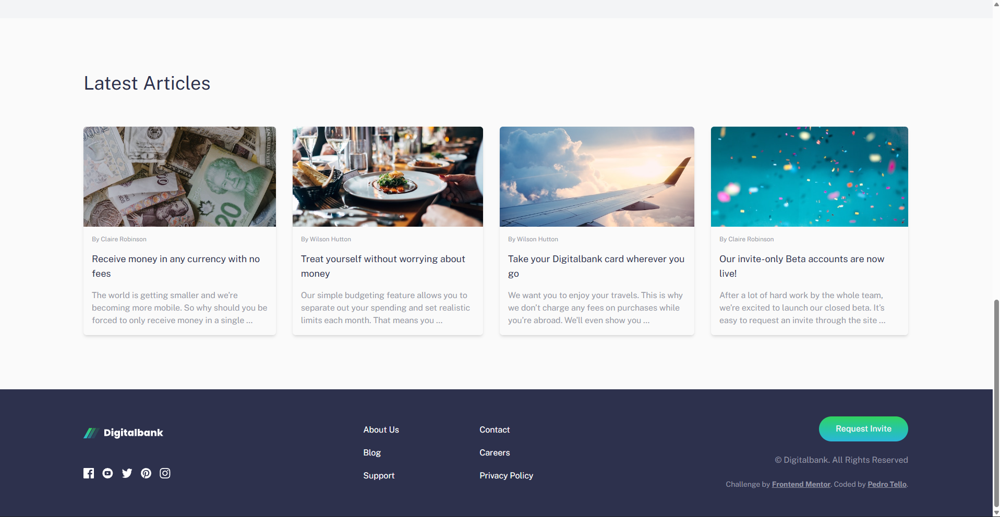

# Frontend Mentor - Digitalbank Landing Page Solution

This is a solution to the [Digitalbank landing page challenge on Frontend Mentor](https://www.frontendmentor.io/challenges/digital-bank-landing-page-WaUhkoDN). Frontend Mentor challenges help you improve your coding skills by building realistic projects.

## Table of contents

- [Overview](#overview)
  - [The challenge](#the-challenge)
  - [Screenshot](#screenshot)
  - [Links](#links)
- [My process](#my-process)
  - [Built with](#built-with)
  - [What I learned](#what-i-learned)
  - [Continued development](#continued-development)
  - [Useful resources](#useful-resources)
- [Author](#author)

## Overview

### The challenge

Users should be able to:

- View the optimal layout for the site depending on their device's screen size
- See hover states for all interactive elements on the page

### Screenshot

### Links
[Live Site URL](https://teshpop.github.io/DigitalBank-FrontendMentor-/)

## My process

### Built with

- Semantic HTML5 markup
- [React](https://reactjs.org/) - JS library
- [Tailwind CSS](https://tailwindcss.com/) - Utility-first CSS framework
- [Vite](https://vitejs.dev/) - Frontend build tool
- Mobile-first workflow

### What I learned

One of the most valuable things I picked up in this project was how to create **overlapping sections** to achieve a visual continuity effect between page sections. Previously I wasn't sure how to pull this off cleanly — getting elements from one section to visually "bleed" into the next without breaking the layout took some experimentation, but the result gives the landing page a much more polished, modern feel.

### Continued development

I want to keep sharpening my Tailwind CSS skills — specifically getting more intentional about how I structure utility classes, when to extract components vs. keep things inline, and making better use of the configuration file for design tokens.

### Useful resources

- [Tailwind CSS Docs](https://tailwindcss.com/docs) - The official documentation was my main reference throughout. The search is great for quickly finding the right utility.
- [Claude](https://claude.ai) - Helped me work through a few tricky layout problems and think through different approaches when I got stuck.

## Author

- GitHub - [Teshpop](https://github.com/Teshpop)
